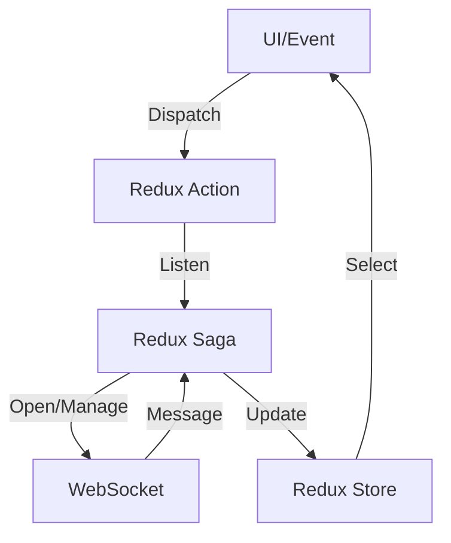

# TokensApp

TokensApp is a cross-platform mobile application designed to provide real-time cryptocurrency token data through a performant and scalable architecture. The core of the app leverages WebSocket connections and Redux Saga to manage live data streams, ensuring up-to-date token prices and seamless state management. Please note that the app's primary focus is on data flow; the graphical interface is intentionally kept simple.

## Key Features

- **Real-time Data**: Connects to the Binance WebSocket API to stream live cryptocurrency token prices.
- **State Management**: Utilizes Redux Toolkit and Redux Saga for robust, scalable state management and side-effect handling.
- **Favorites**: Allows users to mark tokens as favorites for quick access.
- **Minimal UI**: User interface is basic by design, focusing on functionality over aesthetics.

## Architecture Overview

### WebSocket Integration

TokensApp establishes persistent WebSocket connections to Binance's streaming API. Using the [`websocket`](https://www.npmjs.com/package/websocket) package, the app can:

- Subscribe to updates for a list of tokens (`!miniTicker@arr`).
- Subscribe to individual token trades (`<symbol>@trade`).

WebSocket events are managed through Redux Saga event channels, allowing for efficient and controlled processing of incoming messages, connection status, and errors.

### Redux Saga Orchestration

Redux Saga orchestrates asynchronous flows and side effects, making the app resilient and responsive:

- **Connection Lifecycle**: Sagas handle the opening, message reception, error, and closing of WebSocket connections using custom channels.
- **Throttled Updates**: To prevent UI overload, incoming messages are throttled and processed at fixed intervals.
- **Action Watchers**: Sagas watch for actions such as `watchToken` and `watchTokenList` to start or stop WebSocket streams dynamically.



## Code Highlights

- **WebSocket Channels**:  
  `createSocketChannel.ts` wraps the WebSocket client in a Redux Saga event channel, emitting events for connection, message, error, and disconnect.
- **Saga Watchers**:  
  - `watchTokenListWs.saga.ts`: Opens a WebSocket for all tokens.
  - `watchTokenWs.saga.ts`: Opens a WebSocket for a specific token.
  - `watchThrottledMessages.saga.ts`: Handles incoming messages with throttling to avoid excessive state updates.
- **Reducer Slices**:  
  - `ws.slice.ts`: Manages WebSocket connection state and errors.
  - `token.slice.ts`: Handles the token list, favorites, and individual token updates.

## Getting Started

1. **Install Dependencies**
    ```bash
    npm install
    # or
    yarn
    ```

2. **Run the App**
    - For Expo:  
      ```bash
      npx expo start
      ```
    - For React Native CLI:  
      ```bash
      npx react-native run-android
      npx react-native run-ios
      ```

3. **Tests**
    ```bash
    npm test
    ```

## Main Dependencies

- [React Native](https://reactnative.dev/)
- [Redux Toolkit](https://redux-toolkit.js.org/)
- [Redux Saga](https://redux-saga.js.org/)
- [websocket](https://www.npmjs.com/package/websocket)
- [Binance WebSocket API](https://binance-docs.github.io/apidocs/spot/en/#websocket-market-streams)
